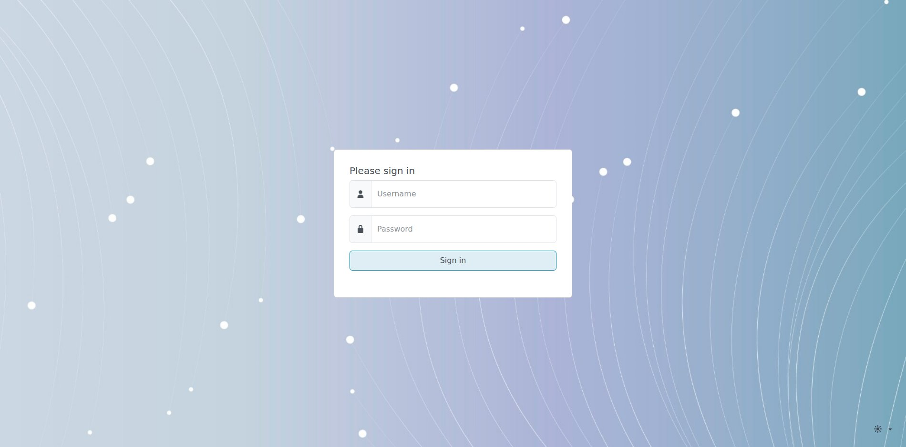
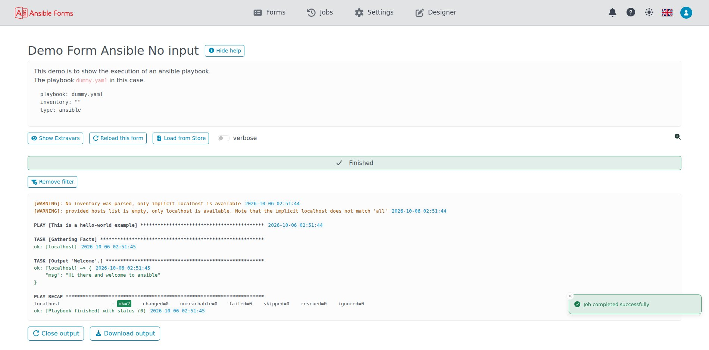
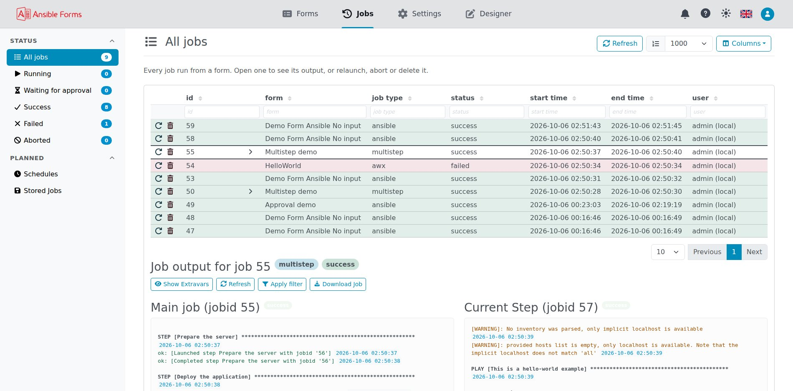
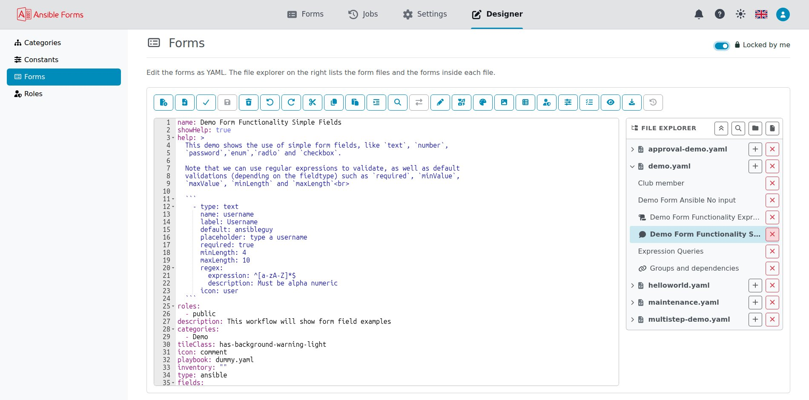
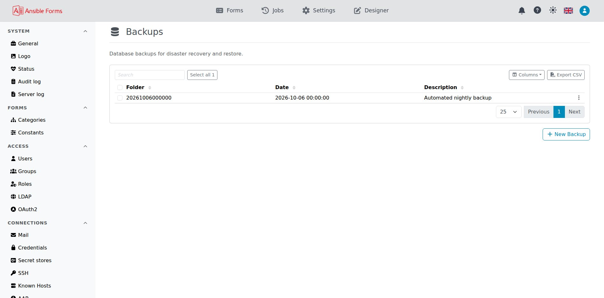
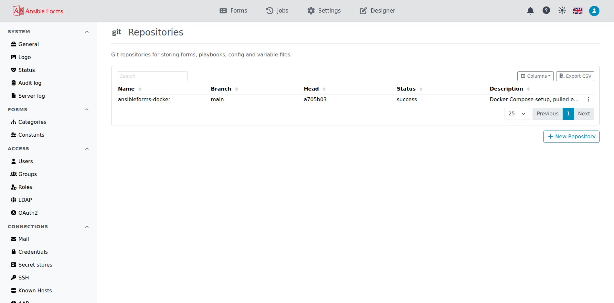
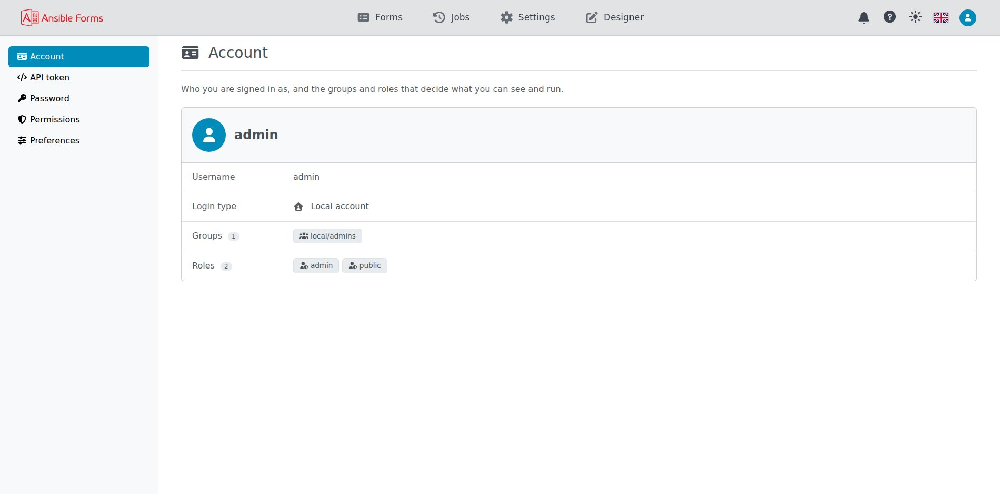

# Graphical User Interface

Visual tour of AnsibleForms' web interface, from the dashboard to advanced administration features.
{: .fs-6 .fw-300 }

---

## Login

User authentication page with support for local, LDAP, EntraID and OIDC authentication.

---

## The Dashboard

The main dashboard displays all available forms organized by category.

---

## A Form

Example of a form with external data sources and dynamic fields.

---

## Form JSON Preview

Preview the JSON payload and extra variables that will be passed to Ansible before running the job.

---

## Running Job

Real-time execution of an Ansible playbook with live output.

---

## Job Output

Complete output from an executed Ansible playbook.

---

## Job Logs

Every job with its status and times, filtered by status from the left menu.

---

## Multi Step

Forms can be split into multiple steps for complex workflows.

---

## Builtin Designer

Edit forms, categories, constants and roles as YAML, with a file explorer for the form files.

---

## Schedules

Schedule forms to run at specific times or intervals.

---

## Backups

Automated backup and restore functionality for forms and configurations.

---

## Restore

Restore forms and configurations from previous backups.

---

## Settings

Application settings and general configuration options.

---

## LDAP Configuration

Configure LDAP/Active Directory authentication and authorization.

---

## Git Repositories

Integrate with Git repositories to version control your forms and playbooks.

---

## Git Repository Editor

Edit and configure Git repository integration settings.

---

## Server Log

The server's own log, under Settings, for troubleshooting and monitoring.

---

## Credential Manager

Securely store and manage credentials used by playbooks.

---

## User Profile

Your account, preferences, password, permissions and API tokens. See [Your profile](profile).

---

## Dark Mode

AnsibleForms supports dark mode for reduced eye strain.

---

## Swagger Interface

Interactive API documentation and testing via Swagger UI.

