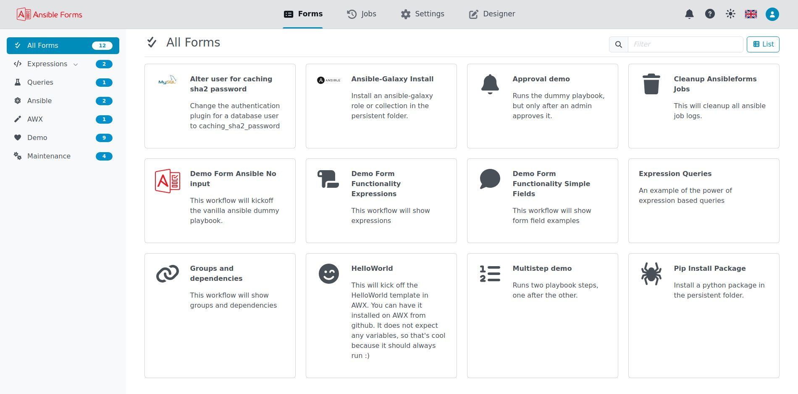

  

    <h1 class="no_toc">Self-service forms for Ansible</h1>
    

      Ansible is a powerful automation tool, but it remains a command-line application, and AWX/AAP/Ascender lacks
      forms that collect data from several sources. AnsibleForms lets you build dynamic, data-driven forms, generate extravars
      and send them to Ansible or AWX/AAP/Ascender.
    

    

      <a href="installation/" class="btn btn-primary">Install AnsibleForms</a>
      <a href="forms/" class="btn btn-outline">Build your first form</a>
    

  

  

    
  

## Quick Navigation
{: .no_toc }

Start with these guides to set up AnsibleForms:

  <a class="af-card" href="installation/">
    <i class="fa-solid fa-rocket"></i>
    <strong>How to install</strong>
    Run it with Docker, Kubernetes or from source
    Installation guide &rarr;
  </a>
  <a class="af-card" href="customization">
    <i class="fa-solid fa-sliders"></i>
    <strong>How to customize</strong>
    Configure it with environment variables
    Environment variables &rarr;
  </a>
  <a class="af-card" href="config/">
    <i class="fa-solid fa-user-shield"></i>
    <strong>Set up config.yaml</strong>
    Define the roles, categories and access control
    Roles &amp; categories &rarr;
  </a>
  <a class="af-card" href="forms/">
    <i class="fa-solid fa-wand-magic-sparkles"></i>
    <strong>Your first form</strong>
    Create forms with fields, validation and sources
    Forms documentation &rarr;
  </a>

## Application Capabilities

What AnsibleForms brings to your Ansible setup:

  

    <i class="fa-solid fa-play"></i>
    <strong>Automation platforms</strong>
    Run playbooks locally or on AWX, AAP or Ascender
  

  

    <i class="fa-solid fa-user-shield"></i>
    <strong>Role based access</strong>
    Limit forms to roles of users and groups
  

  

    <i class="fa-solid fa-calendar-days"></i>
    <strong>Job scheduling</strong>
    Run a form later, or on a cron schedule
  

  

    <i class="fa-solid fa-comments"></i>
    <strong>Chat assistant</strong>
    Fill in and launch forms by chatting
  

  

    <i class="fa-solid fa-folder-tree"></i>
    <strong>Categories</strong>
    Group the forms in a tree of categories
  

  

    <i class="fa-solid fa-key"></i>
    <strong>Authentication</strong>
    Local, LDAP, Entra ID and OIDC logins
  

  

    <i class="fa-solid fa-clock-rotate-left"></i>
    <strong>Job history</strong>
    See past jobs, abort running ones, relaunch
  

  

    <i class="fa-solid fa-sliders"></i>
    <strong>Configuration</strong>
    Set up the server with environment variables
  

  

    <i class="fa-solid fa-vault"></i>
    <strong>Credential manager</strong>
    Store credentials and pass them to playbooks
  

  

    <i class="fa-solid fa-code-branch"></i>
    <strong>Git repositories</strong>
    Sync forms and playbooks with Git
  

  

    <i class="fa-solid fa-plug"></i>
    <strong>REST API</strong>
    A REST API with Swagger documentation
  

  

    <i class="fa-solid fa-floppy-disk"></i>
    <strong>Stored jobs</strong>
    Save form data and load it later to pre-fill
  

  

    <i class="fa-solid fa-user-lock"></i>
    <strong>Role options</strong>
    Decide who may use each feature
  

  

    <i class="fa-solid fa-database"></i>
    <strong>Automated backups</strong>
    Nightly backups with configurable retention
  

  

    <i class="fa-solid fa-pen-ruler"></i>
    <strong>Designer</strong>
    Edit forms as YAML, with validation
  

  

    <i class="fa-solid fa-robot"></i>
    <strong>MCP server</strong>
    Let AI agents list and launch your forms
  

  <button type="button" class="btn btn-outline af-expand" aria-expanded="false" aria-controls="app-capabilities">Show all 16</button>

## Form Capabilities

What a single form can do:

  

    <i class="fa-solid fa-sitemap"></i>
    <strong>Cascaded dropdowns</strong>
    Dropdowns that react to other fields
  

  

    <i class="fa-solid fa-database"></i>
    <strong>Database sources</strong>
    Query MySQL, Oracle, MongoDB and more
  

  

    <i class="fa-solid fa-list-ol"></i>
    <strong>Multistep forms</strong>
    Run several playbooks in steps from one form
  

  

    <i class="fa-solid fa-shoe-prints"></i>
    <strong>Wizard forms</strong>
    Split input across pages with Back and Next
  

  

    <i class="fa-solid fa-code"></i>
    <strong>Server expressions</strong>
    Fetch data from REST APIs, files and more
  

  

    <i class="fa-solid fa-calculator"></i>
    <strong>Local expressions</strong>
    JavaScript in the browser to compute values
  

  

    <i class="fa-solid fa-eye"></i>
    <strong>Field dependencies</strong>
    Show or hide fields based on other fields
  

  

    <i class="fa-solid fa-palette"></i>
    <strong>Visualization</strong>
    Icons, images, colors and a responsive grid
  

  

    <i class="fa-solid fa-check-double"></i>
    <strong>Field validations</strong>
    Min, max, regex, in and more
  

  

    <i class="fa-solid fa-layer-group"></i>
    <strong>Group fields</strong>
    Group fields vertically and horizontally
  

  

    <i class="fa-solid fa-diagram-project"></i>
    <strong>Output modelling</strong>
    Shape the extravars into your own objects
  

  

    <i class="fa-solid fa-stamp"></i>
    <strong>Approval points</strong>
    Pause a job until someone approves it
  

  

    <i class="fa-solid fa-cubes"></i>
    <strong>Structured fields</strong>
    Lists and objects backed by reusable subforms
  

  

    <i class="fa-solid fa-stopwatch"></i>
    <strong>Scheduled forms</strong>
    Run on a cron schedule or at a set time
  

  

    <i class="fa-solid fa-envelope"></i>
    <strong>Email notifications</strong>
    Send an email when a job finishes
  

  

    <i class="fa-solid fa-shield-halved"></i>
    <strong>Launch validation</strong>
    Check every launch on the server
  

  <button type="button" class="btn btn-outline af-expand" aria-expanded="false" aria-controls="form-capabilities">Show all 16</button>

## Tech stack

What AnsibleForms is built with:

<table>
  <thead>
    <tr>
      <th style="width: 25%;">Component</th>
      <th>Technology</th>
    </tr>
  </thead>
  <tbody>
    <tr>
      <td><strong>Backend</strong></td>
      <td>Node.js / Express</td>
    </tr>
    <tr>
      <td><strong>Database</strong></td>
      <td>MySQL</td>
    </tr>
    <tr>
      <td><strong>Frontend</strong></td>
      <td>Vue 3</td>
    </tr>
    <tr>
      <td><strong>Layout</strong></td>
      <td>Bootstrap 5 / Font Awesome</td>
    </tr>
  </tbody>
</table>

## Requirements

{: .warning }
> **Requirements depend on how you plan to install AnsibleForms.** [See the installation section to learn more.](installation)

