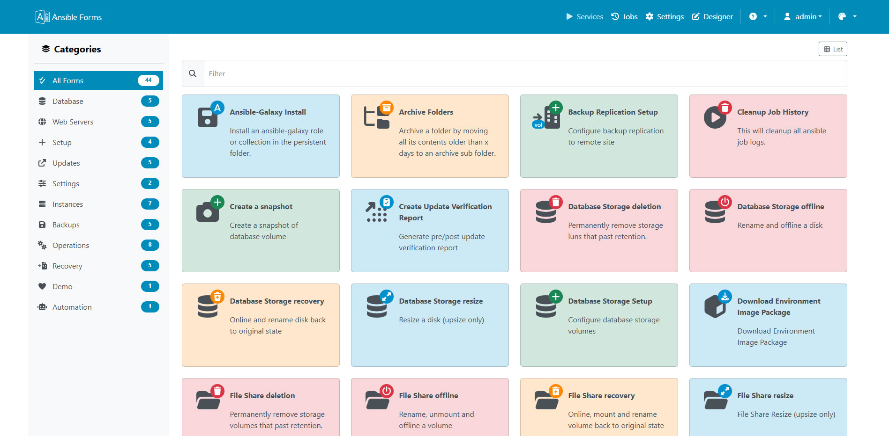

  

    <h1 class="no_toc">Self-service forms for Ansible</h1>
    

      Ansible is a powerful automation tool, but it remains a command-line application, and AWX/AAP/Ascender lacks
      forms that collect data from several sources. AnsibleForms lets you build dynamic, data-driven forms, generate extravars
      and send them to Ansible or AWX/AAP/Ascender.
    

    

      <a href="installation/" class="btn btn-primary">Install AnsibleForms</a>
      <a href="forms/" class="btn btn-outline">Build your first form</a>
    

  

  

    
  

<a class="af-card af-deprecated" href="/upgrade-7.html">
  <i class="fa-solid fa-triangle-exclamation"></i>
  <strong>AnsibleForms 6.x is deprecated</strong>
  Version 7 is the current release. The upgrade guide lists what to change while you are still on 6.5,
  before you move to 7.
  Upgrading to v7 &rarr;
</a>

---

## Capabilities

What AnsibleForms brings to your Ansible setup, and what a single form can do:

  

    
<i class="fa-solid fa-server" aria-hidden="true"></i>Application

    <ul class="af-feature-list">
      <li>
        <i class="fa-solid fa-play" aria-hidden="true"></i>
        <strong>Automation platforms</strong>Run playbooks locally or on AWX, AAP or Ascender
      </li>
      <li>
        <i class="fa-solid fa-user-shield" aria-hidden="true"></i>
        <strong>Access control</strong>Roles and role options, with local, LDAP, Entra ID and OIDC logins
      </li>
      <li>
        <i class="fa-solid fa-calendar-days" aria-hidden="true"></i>
        <strong>Scheduling</strong>Run a form later, or on a cron schedule
      </li>
      <li>
        <i class="fa-solid fa-clock-rotate-left" aria-hidden="true"></i>
        <strong>Job history</strong>Follow, abort and relaunch jobs
      </li>
      <li>
        <i class="fa-solid fa-vault" aria-hidden="true"></i>
        <strong>Credentials and secrets</strong>Store credentials, or read them from HashiCorp Vault
      </li>
      <li>
        <i class="fa-solid fa-code-branch" aria-hidden="true"></i>
        <strong>Git repositories</strong>Keep forms, playbooks and configuration in Git
      </li>
      <li>
        <i class="fa-solid fa-pen-ruler" aria-hidden="true"></i>
        <strong>Designer</strong>Edit forms as YAML, with validation
      </li>
      <li>
        <i class="fa-solid fa-plug" aria-hidden="true"></i>
        <strong>API, MCP and chat</strong>Launch forms from scripts, AI agents or a chat
      </li>
    </ul>
  

  

    
<i class="fa-solid fa-rectangle-list" aria-hidden="true"></i>Forms

    <ul class="af-feature-list">
      <li>
        <i class="fa-solid fa-sitemap" aria-hidden="true"></i>
        <strong>Cascaded dropdowns</strong>Dropdowns that react to other fields
      </li>
      <li>
        <i class="fa-solid fa-database" aria-hidden="true"></i>
        <strong>Expressions and data sources</strong>Fill fields from databases, REST APIs, files and JavaScript
      </li>
      <li>
        <i class="fa-solid fa-eye" aria-hidden="true"></i>
        <strong>Field dependencies</strong>Show or hide fields based on other fields
      </li>
      <li>
        <i class="fa-solid fa-check-double" aria-hidden="true"></i>
        <strong>Validation</strong>Min, max, regex and more, optionally checked on the server
      </li>
      <li>
        <i class="fa-solid fa-list-ol" aria-hidden="true"></i>
        <strong>Multistep and wizard forms</strong>Run playbooks in steps, or split input across pages
      </li>
      <li>
        <i class="fa-solid fa-cubes" aria-hidden="true"></i>
        <strong>Structured fields</strong>Lists and objects backed by reusable subforms
      </li>
      <li>
        <i class="fa-solid fa-stamp" aria-hidden="true"></i>
        <strong>Approval points</strong>Pause a job until someone approves it
      </li>
      <li>
        <i class="fa-solid fa-envelope" aria-hidden="true"></i>
        <strong>Notifications</strong>Send an email when a job finishes
      </li>
    </ul>
  

## Tech stack

What AnsibleForms is built with:

<table>
  <thead>
    <tr>
      <th style="width: 25%;">Component</th>
      <th>Technology</th>
    </tr>
  </thead>
  <tbody>
    <tr>
      <td><strong>Backend</strong></td>
      <td>Node.js / Express</td>
    </tr>
    <tr>
      <td><strong>Database</strong></td>
      <td>MySQL</td>
    </tr>
    <tr>
      <td><strong>Frontend</strong></td>
      <td>Vue 3</td>
    </tr>
    <tr>
      <td><strong>Layout</strong></td>
      <td>Bootstrap 5 / Font Awesome</td>
    </tr>
  </tbody>
</table>
